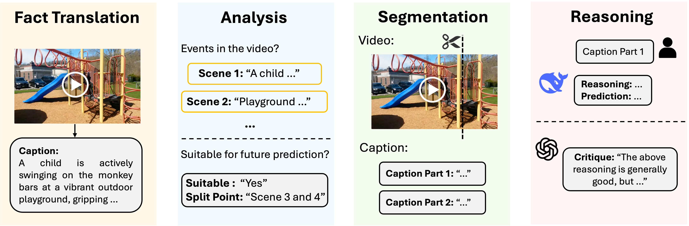
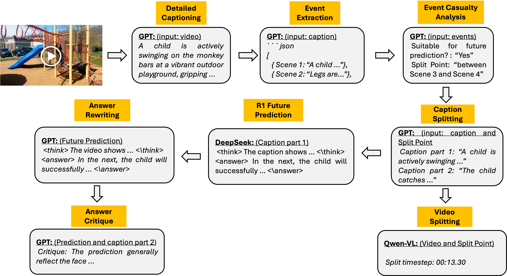

<div align="center">

# V1: Toward Multimodal Reasoning by Designing Auxiliary Task


<div>
🚀  Toward Multimodal Reasoning via Unsupervised Task -- Future Prediction 🌟
</div>
</div>
<div>
<br>

<div align="center">

[](https://github.com/haonan3/V1)
[](https://faint-basin-c34.notion.site/V1-Toward-Multimodal-Reasoning-by-Designing-Auxiliary-Task-1b2db15ae55b800da077e70aafe40212) 
[]()
[](https://huggingface.co/datasets/haonan3/V1-33K)

</div>

</div>

---

## Table of Contents

- [Introduction](#multimodal-reasoning)
- [Why Video Future Prediction?](#why-video-prediction)
- [Dataset & Download](#dataset)
- [Data Construction](#data-construction)
- [On-Going Work](#on-going-work)
- [Citation](#citation)

---
## Multimodal Reasoning

Recent Large Reasoning Models (LRMs) such as DeepSeek-R1 have demonstrated impressive reasoning abilities; however, their capabilities are limited to textual data. Current models capture only a small part of the rich information that humans naturally use, which limits our progress toward AGI.

## Future Prediction Task and Dataset

To advance multimodal reasoning, we introduce a future prediction task and its corresponding dataset. Predicting the future is a deeply desired ability, yet forecasting upcoming events from historical video data presents significant challenges for current Multi-modal Large Models (MLMs). Our task pushes these models to infer future events based on the first part of a video, with the second part serving as open-ended ground truth for evaluation.

> **🤔 <ins>Why isn’t factual answering ideal for video reasoning?</ins>**  
> Research indicates that reasoning models like DeepSeek R1 often “over-think”, which can lead to hallucinations. When applied to video data, similar pitfalls emerge if the model is restricted to answering straightforward factual questions. For instance, querying “Where is the cat in the video?” might prompt an overly extended reasoning process, inadvertently increasing the risk of hallucinated outputs.

> **💡 <ins>Why is future prediction a compelling case for video reasoning?</ins>** <a id="why-video-prediction"></a>   
> Much like Doctor Strange’s foresight in `Avengers 3: Infinity War (2018)`, predicting the future demands reasoning over multiple potential outcomes. This challenge is analogous to techniques such as Monte Carlo tree search (MCTS), which systematically explores a wide array of possible scenarios. The inherent complexity of future prediction makes it a powerful task for evaluating and enhancing video reasoning capabilities.  
>  
> 

> **📽️ <ins>Video Future Prediction: A Self-Supervised Task for Multimodal Reasoning</ins>**  
> This task is inherently Self-Supervised Learning (SSL). It leverages the inherent causal logic present in video data. By dividing videos into sequential segments, we create implicit labels that embody the natural flow of cause and effect—allowing models to learn from the logical progression of events *without* the need for manual annotations.  
>  
> Much like `Image Contrastive Learning`, which uses inherent data structures to construct labels and guide what a model should capture, `Video Future Prediction` is grounded in the philosophy that real-world events unfold through a chain of cause and effect. It drives the model to focus on the temporal and causal dimensions that underpin real-world scenarios, enhancing multimodal reasoning capabilities. By integrating visual cues, the model develops a holistic reasoning ability to more accurately predict and interpret the progression of complex events.  
>  
> Moreover, like other self-supervised learning tasks and unsupervised learning, the data construction is relatively cheap, making it a scalable solution for enhancing multimodal reasoning capabilities.


---

## Dataset

Our dataset is curated from diverse video sources and built upon established datasets [LLaVA-Video-178K](https://huggingface.co/datasets/lmms-lab/LLaVA-Video-178K) and [Ego4D](https://ego4d-data.org/). Below are some statistics:

| Dataset    | Number of Videos | Duration Range | Number of Videos |
|------------|------------------|----------------|----------------|
| activitynet| 6,497            | 0–30 seconds   |8,294           |
| Charades   | 3,692            | 30–60 seconds  |8,832           |
| ego4d      | 863              | 1–2 minutes    |8,832           |
| NextQA     | 2,142            | 2–3 minutes    |7,248           |
| youcook2   | 2,757            |   **Total**  | **33,206**       |
| youtube    | 17,255           |    


### Downloading the Dataset

The V1 dataset (33K videos) is available on Hugging Face. To download, run:

```python
import os
import tarfile
from huggingface_hub import snapshot_download

def download_dataset(data_folder: str) -> None:
    repo_id = "haonan3/V1-33K"
    dataset_dir = os.path.join(data_folder, "V1-33K")
    print(f"Downloading dataset: {repo_id}")
    snapshot_download(
        repo_id=repo_id,
        repo_type="dataset",
        local_dir=dataset_dir,
        cache_dir=dataset_dir
    )
    print("Download completed.")

def extract_archives(data_folder: str) -> None:
    dataset_dir = os.path.join(data_folder, "V1-33K")
    prefix = "video_data_part"
    start, end = 0, 70

    print(f"Extracting archives in directory: {dataset_dir}")
    for i in range(start, end):
        tar_file = f"{prefix}{i}.tar.gz"
        tar_path = os.path.join(dataset_dir, tar_file)
        if not os.path.exists(tar_path):
            print(f"Archive not found: {tar_path}")
            continue
        try:
            with tarfile.open(tar_path, "r:gz") as tar:
                tar.extractall(path=dataset_dir)
            print(f"Extracted: {tar_path}")
        except Exception as e:
            print(f"Failed to extract {tar_path}: {e}")
    print("Extraction completed.")

if __name__ == '__main__':
    data_folder = '.'  # Change this to your desired directory
    download_dataset(data_folder)
    extract_archives(data_folder)
```

Alternatively, you can visit the [Hugging Face page](https://huggingface.co/datasets/haonan3/V1-33K) to download the dataset directly.

---

## Data Construction

Our data construction has four stages:



---

The detailed processing pipeline:



---

## On-Going Work

- **Dataset Scale-Up:**  
  [ ] Incorporate multiple QA annotations per video.

  [ ] Release additional video reasoning data from varied sources.

  [ ] Curate data that demonstrably enhances reasoning (e.g., leveraging LIMO).

- **Model Training:**  
  [ ] Apply supervised fine-tuning (SFT) on long chain-of-thought (CoT) data.

  [ ] Perform critique fine-tuning (CFT) to improve robustness.

  [ ] Experiment with PPO and GRPO techniques to further boost video reasoning performance.

- **Benchmark Development:**  
  [ ] Create a comprehensive Future Prediction Benchmark to evaluate multimodal reasoning models.

---

## Citation

If you find this work helpful, please consider citing:

```latex
@misc{wang2025v1,
      title={V1: Toward Multimodal Reasoning by Designing Auxiliary Task}, 
      author={Haonan Wang, Chao Du, Tianyu Pang},
      year={2025},If you find this blog or our dataset helpful, please consider citing:
      url={https://faint-basin-c34.notion.site/1b2db15ae55b800da077e70aafe40212}, 
}
```